# 😷📱💉 **Minha Vacina**: aplicativo para criar lembretes e monitorar campanhas de vacinação 📆💖

<h1 align="center">
    

</h1>

# 📝 Sobre

**Minha Vacina** é um projeto de conclusão do curso [Sistemas de Informação](https://cesmac.edu.br/graduacao/sistemas-de-informacao) do [Centro Universitário Cesmac](https://cesmac.edu.br/), foi realizado pelos formandos [Edvan Oliveira](https://www.linkedin.com/in/edvan-oliveira-0822b2227/) e [Pedro Felipe](https://www.linkedin.com/in/pedro-felipe-6184b0159/), sob orientação do mestre [Carlos Lessa](https://www.linkedin.com/in/carloswgama).

O objetivo inicial do sistema **Minha Vacina** era o desenvolvimento de um software que diminuísse as filas por buscas de informações sobre a COVID-19 e ao mesmo tempo auxiliasse as pessoas a não perderem os prazos de vacinação. Com a evolução do software percebemos que seu potencial iria além da COVID-19 e ampliamos seus recursos para auxiliar na vacinação de outras doenças.
</br>
</br>

📱 **Minha Vacina APP**

- O aplicativo Minha Vacina, se propõe a atuar como uma ferramenta de lembretes e monitoramento de campanhas de vacinação a respeito da condição da vacinação contra a covid-19 e outras doenças. A aplicação foi concebida de forma a ser uma solução que possibilite o aviso instantâneo aos seus usuários em uma possível campanha de vacinação que esteja ativa e também ser lembrado o dia exato que adicionou o lembrete da campanha.

- Tal campanha poderá ser criada em um gerenciador pelo órgão responsável, e o usuário automaticamente receberá uma notificação da campanha, possibilitando o mesmo acompanhar as informações relevantes da campanha como: data, horário, locais, idade e tempo de duração.

💻 **Minha Vacina Web**

- O gerenciador da web, tem uma tela inicial onde irá listar as campanhas ativas/inativas, ele tem a função de cadastrar e acompanhar as campanhas que serão listadas no aplicativo. Tendo em vista essa funcionalidade, o órgão responsável poderá cadastrar, atualizar e ativar ou desativar as campanhas do município.

🎮 **Minha Vacina API**

- Web service, é um dos pilares entre essa aplicação que é o mais importante, sem ela o aplicativo não tem vida. O mesmo gerência o backend da aplicação, onde faz o papel de se comunicar com o gerenciador da web e o aplicativo ao mesmo tempo. Fazendo a comunicação com banco de dados onde ficaram todos os dados e informações que nele forem requisitadas.

<br/>

# 🎥 Vídeo

Esse vídeo demonstrativo descreve a principal função do sistema Minha Vacina. No vídeo podemos ver os seguintes passos:

1. Cadastrar um novo usuário no APP.

2. Associar esse usuário cadastrado com a vacina do coronavírus.

3. Entrar no gerenciador Web e cadastrar uma nova campanha de vacinação contra o coronavírus.

4. Notificar o usuário do APP que uma nova campanha de vacinação contra o coronavírus foi cadastrada em seu município.

5. O usuário do APP recebe a notificação, clica nela e é redirecionado para a tela de detalhes da nova campanha cadastrada no gerenciador Web.

6. E por fim, ainda na tela de detalhes da campanha, o usuário do APP clica no botão para ser lembrado da campanha contra o coronavírus.

<br/>

⚠️🚨 ATENÇÃO: Acesse o YouTube para assistir com melhor experiência: [clique aqui](https://youtu.be/mqU3XniaJXc)  🚨⚠️

<br/>

<div align="center">
    
</div>

<br/>

# 🎨 Imagens

<div>

## 📱 Minha Vacina APP

</div>

<div>
    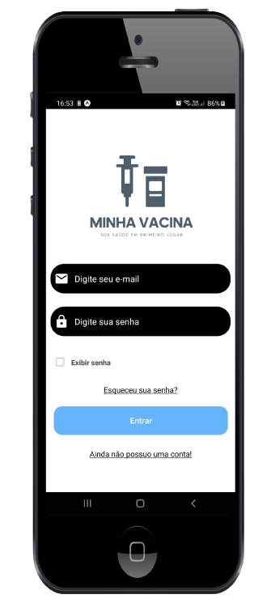
    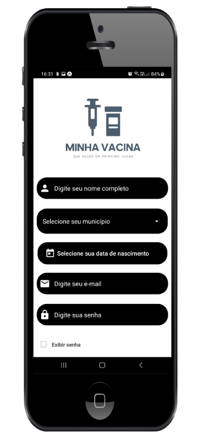
    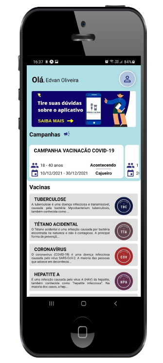
    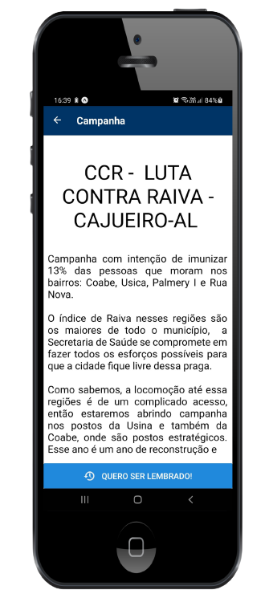
    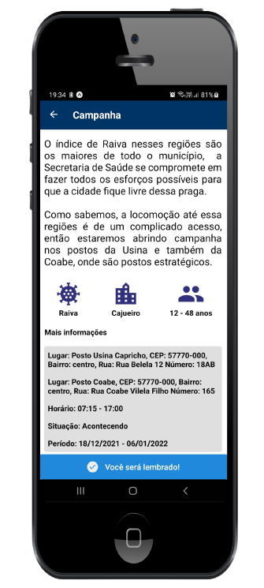
    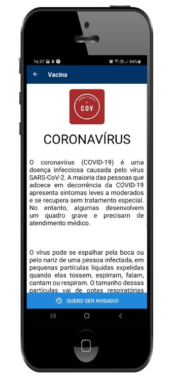
    
</div>

<br/>

## 💻 Minha Vacina Web

<div style="display: flex; flex-wrap: wrap;">
    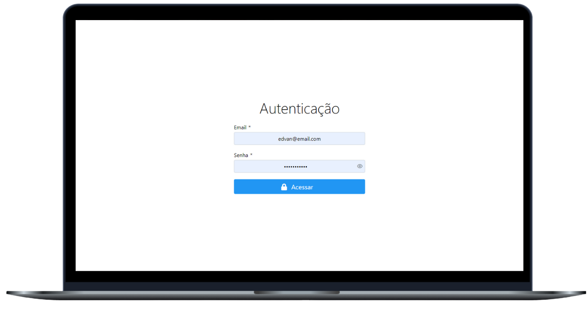
    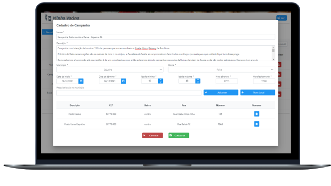
    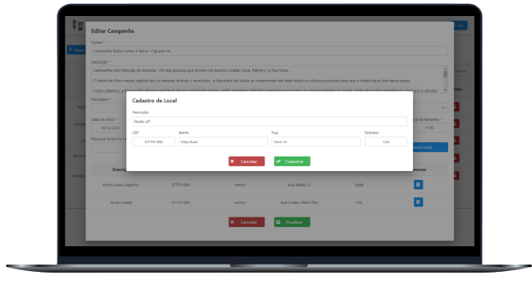
    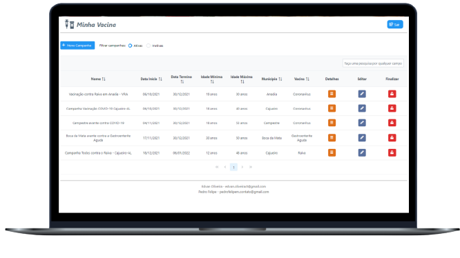
    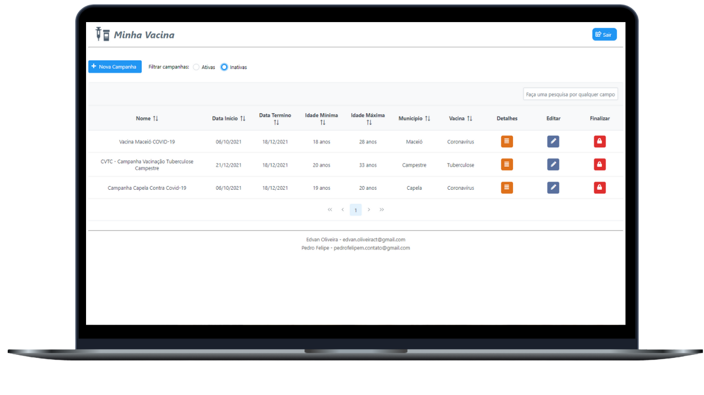
    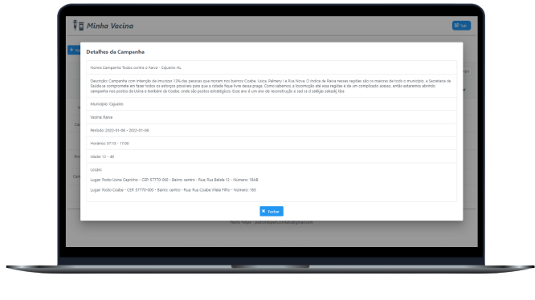
    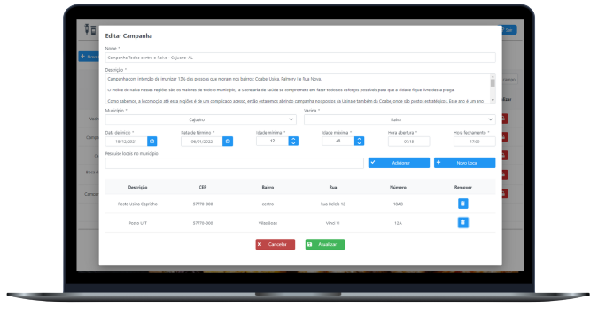
    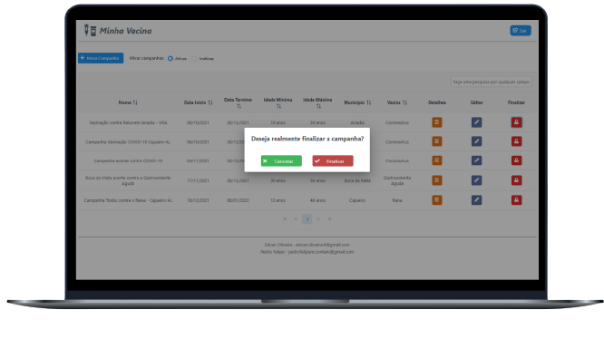
</div>

<br/>

## 🎮 Minha Vacina API

Para realizar a comunicação entre os sistemas, foi utilizado o modelo de arquitetura Web Service, seguinde os padrões REST. Como podemos ver na imagem abaixo, o Minha Vacina API está no centro do arquitetura e é responsavél por gerenciar e realizar a comunicação de todo o sistema.

<div align="center">
    
</div>
<br/>

# 🚀 Tecnologias utilizadas

Como podemos ver no repositório, o software **Minha Vacina** consiste em um conjunto de três sistemas que interagem entre si trocando dados e informações, são eles: **Minha Vacina API**, **Minha Vacina Web** e **Minha Vacina APP**.

## 🎮 Minha Vacina API

- Java
- Spring Boot
- PostgreSQL
- Token JWT
- Spring Security
- Spring Data JPA
- Lombok
- Maven
- Firebase Cloud Messaging

## 💻 Minha Vacina Web

- Java
- JavaServer Faces
- Lombok
- Maven
- Primefaces
- PrimeFlex
- CSS3
- Servidor Tomcat

## 📱 Minha Vacina APP

- TypeScript
- JavaScript
- React Native
- Expo
- NPM
- Axios
- NodeJS
- CSS
- HTMLView

<br/>

# ✏️ Pré-requisitos

Para conseguir executar as instruções a seguir e rodar os três projetos, será necessário instalar os seguintes programas: [Java](https://www.java.com/pt-BR/), [NodeJS](https://nodejs.org/en/), [Git](https://git-scm.com/), [PostgreSQL](https://www.postgrescompare.com/), [Maven](https://maven.apache.org/) e também é fortemente recomendado o uso de [IDEs](https://usemobile.com.br/ide/) como [VSCode](https://code.visualstudio.com/) e [Eclipse](https://www.eclipse.org/downloads/).

<br/>

# 👓 Instruções de como rodar os projetos

Para a aplicação conseguir rodar é preciso preparar o banco de dados, vamos começar criando uma base de dados no [PostgreSQL](https://www.postgrescompare.com/) chamada _'minha_vacina'_

```sql
    CREATE DATABASE minha_vacina ENCODING 'UTF8';
```

Em seguida é necessário criar o usuário com permissão de login, o nome será _tcc_ e a senha _123456_

```sql
    CREATE ROLE tcc WITH LOGIN SUPERUSER PASSWORD '123456';
```

⚠️🚨 **ATENÇÃO:** depois de executar o **Minha Vacina API**, o Spring Boot irá criar todas as tabelas de forma automática 🚨⚠️

Depois do Spring Boot criar as tabelas, é necessário criar um usuário administrador para conseguir realizar o login no **Minha Vacina Web**. O email será *admin@admin.com* e a senha _admin_.

```sql
    -- Inserindo as permissões dos usuários
    INSERT INTO permissoes (descricao)
    VALUES ('ROLE_APP'), ('ROLE_WEB');

    -- Inserindo o usuário administrador (senha criptografada)
    INSERT INTO usuarios (email, senha )
    VALUES ('admin@admin.com', '$2a$12$r8nNfu.xdMma2v0buFNzJ.RCR5dHAJ9ec4Fw9OCcjbtQ4CR4MGVga');

    -- Setando permissão de administrador ao usuário admin
    INSERT INTO usuarios_permissoes (usuario_id, permissao_id)
    VALUES (1, 2);
```

## 🎮 Minha Vacina API

```bash
$ git clone https://github.com/Edvan-Oliveira/minha-vacina-api.git

$ cd minha-vacina-api

$ mvn clean install

$ mvn spring-boot:run

# Se a aplicação rodou, não é necessário seguir os próximos passos
$ cd target

$ java -jar minha-vacina-api-0.0.1-SNAPSHOT.jar
```

## 📱 Minha Vacina APP

```bash
$ git clone https://github.com/Pedrofelipem/minha-vacina-app.git

$ cd minha-vacina-app

$ npm i

$ npm start
```

## 💻 Minha Vacina Web

Para o Minha Vacina Web as configurações precisam de passos extras.

```bash
$ git clone https://github.com/Edvan-Oliveira/minha-vacina-web.git

$ cd minha-vacina-web

$ mvn clean install
```

Depois de executar os comando a cima é recomendado o uso de uma IDE para facilitar a integração do projeto web com o servidor tomcat, recomendo o [Eclipse](https://www.eclipse.org/downloads/) ou [Intellij](https://www.jetbrains.com/pt-br/idea/).

- [Tutorial de configuração do tomcat no Eclipse](https://www.devmedia.com.br/instalacao-e-configuracao-do-apache-tomcat-no-eclipse/27360)
- [Tutorial de configuração do tomcat no Intellij](https://rafaelomarques.wordpress.com/2010/09/07/integrar-intellij-idea-com-tomcat/)

<br/>

# 🔗 Links para os repositórios de cada projeto

- [Minha Vacina APP (Pedro Felipe)](https://github.com/Pedrofelipem/minha-vacina-app.git)
- [Minha Vacina API (Edvan Oliveira)](https://github.com/Edvan-Oliveira/minha-vacina-api.git)
- [Minha Vacina Web (Edvan Oliveira)](https://github.com/Edvan-Oliveira/minha-vacina-web.git)

<br/>

## Contatos

Edvan Oliveira

<div>
    <a href="https://www.linkedin.com/in/edvan-oliveira-0822b2227/" target="_blank"></a>
  <a href = "mailto:edvan.oliveiract@gmail.com"></a>
  <a href = "https://t.me/Edvan_Oliveira"></a>

</div>

#

Pedro Felipe

<div>
    <a href="https://www.linkedin.com/in/pedro-felipe-6184b0159/" target="_blank"></a>
  <a href = "mailto:pedrofelipem.contato@gmail.com"></a>
  <a href = "https://t.me/Pedrofelipem"></a>
</div>

#
